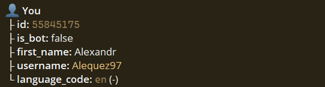
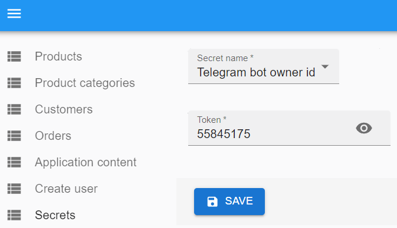
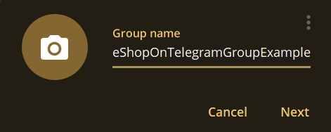

# How to setup telegram group

***:warning: IMPORTANT: Start this instruction walkthrough only when your telegram bot token setup in admin panel is done and your bot started responding to start command***

1. Before you can setup telegram group you have to add your unique telegram id in admin panel. This is required to allow only user with this id add telegram bot to group. To find you unique id in telegram you can use telegram bot. [Click here to open telegram id bot](https://t.me/getidsbot)

2. Open bot and click /start. You should see information with your id.

3. Copy id and paste in admin panel

4. Click save. After save you have to see message, that bot owner id is updated

5. Now you are ready to setup telegram group where bot will be able to send messages about new received orders. Go to telegram and create group with your desired name.

6. Find your bot and add as group member. You can also add other people from your team to this group. When you are done with group members - click 'Create'.

7. Now your group done. If all was done coreclty you should see welcome message from bot.