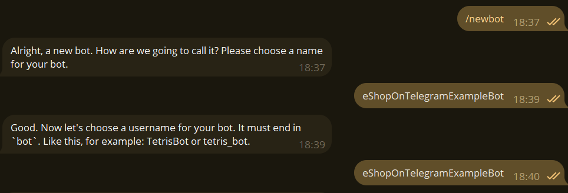
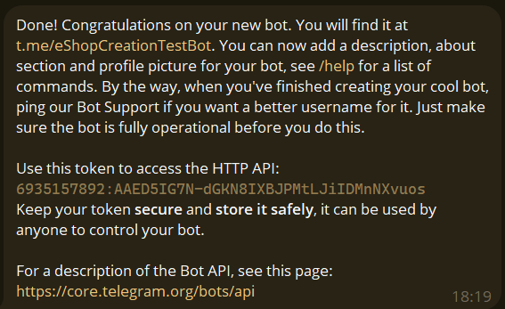
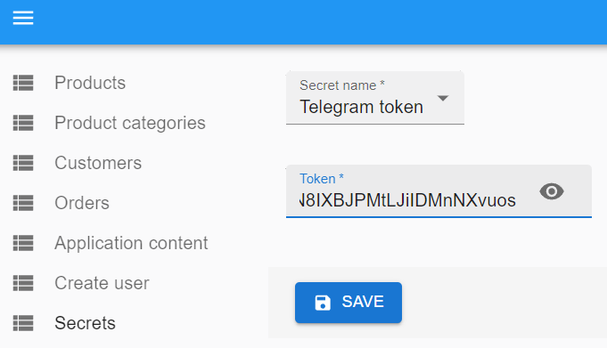

# How to setup telegram bot

1. Find @BotFather bot in Telegram

2. Open bot and click /start.

3. Press /newbot and answer telegram questions.

4. When you are done you will message from @BotFather, that bot is created, simillar as below

5. Copy HTTP API token into admin panel

6. Click save. After save you have to see message, that token is updated

7. Now you finished your bot setup. It can take up to 5 minutes after token update, before you will start receiving messages in your created telegram bot

:white_check_mark: Telegram bot setup done! :white_check_mark: