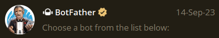
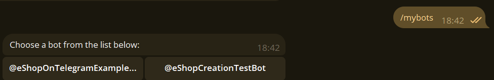
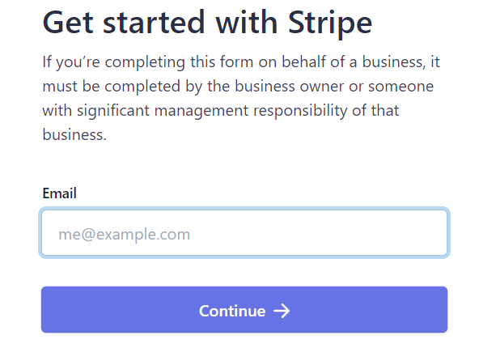
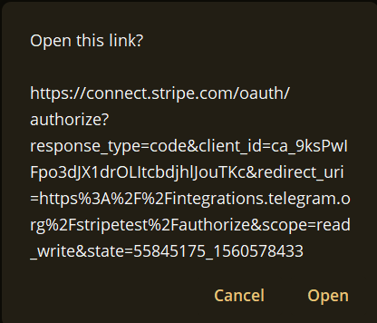
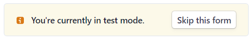
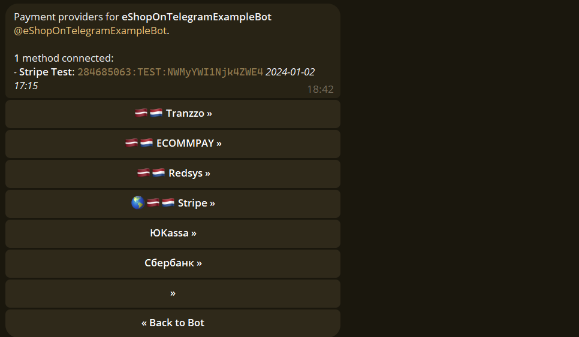
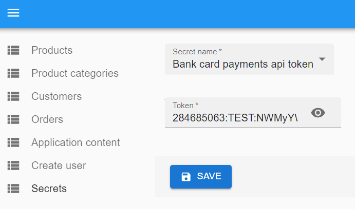

# How to setup payments

1. Find @BotFather bot in Telegram

2. Open bot and click /start.

3. Press /mybots and choose what bot you want to setup for card payments.

4. Choose and click bot. You will see layout as below

5. Press 'Payments'

6. You will see list of available card payments gateways provided by telegram.
   ***Note: Payments are not hold by our system or telegram. Payments are hold by gateway what you will choose. We just create integration with payment gateways.***

7. When you will choose payment provider on next step you will see instructions to setup payments token. Next steps will be shown using Stripe payment provider.

7.1. Select payment provider:

7.2. When you select payment provider you will see option to connect 'Test' or 'Live' payment gateway

7.3. Choose 'Live' when you ready to setup real-world payments. When you choose this option, you will be redirected to provider page and you will have to fill out a form with question about your business. Below is example of Stripe first page:

7.4. When you will be done with all steps, you will recieve API token to start receive card payments. Next tutorial steps will be shown using 'Stripe Test'. Click 'Connect Stripe Test'.

7.5. Now you are redirected to Stripe payments test telegram bot. Click /start. After that click 'Authorize' button. Click open on confirmation dialog:

7.6. Now you will see Stripe payment setup page. For test payments setup you will see button to skip form filling:

   ***Note: When connecting Live payment you won't see option to skip form. You will have to fill all data***

7.7. After that you will be redirected back to @Botfather and should see your payments API token:

8. Copy Payments API token into admin panel

9. Click save. After save you have to see message, that token is updated

10. Now you finished your card payments setup. It can take up to 5 minutes after token update, before your payment method will start to work in telegram

**Card payments in your telegram bot setup done!**