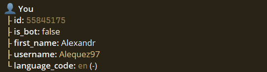
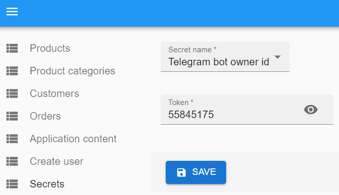
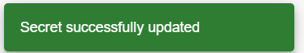
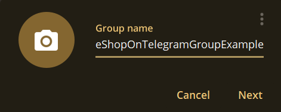
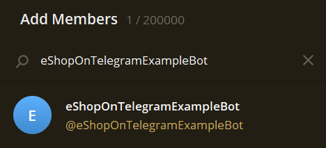
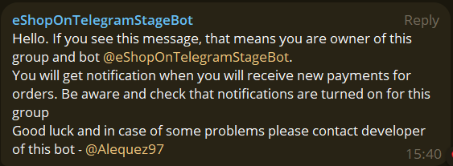
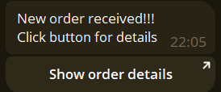
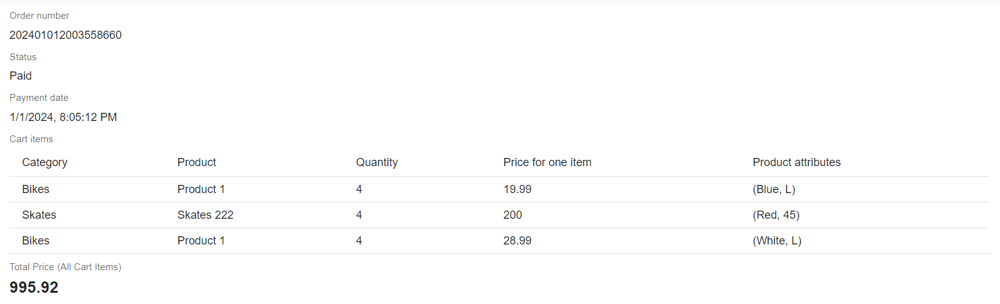

# How to setup telegram group

***:warning: IMPORTANT: Start this instruction walkthrough only when your telegram bot token setup in admin panel is done and your bot started responding to start command***

1. Before you can setup telegram group you have to add your unique telegram id in admin panel. This is required to allow only user with this id add telegram bot to group. To find you unique id in telegram you can use telegram bot. [Click here to open telegram id bot](https://t.me/getidsbot)

2. Open bot and click /start. You should see information with your id.

3. Copy id and paste in admin panel

4. Click save. After save you have to see message, that bot owner id is updated

5. :warning: ***IMPORTANT:*** Before you proceed to next steps you have to wait up to 5 minutes. Each secret update restarts your telegram bot server. This is required to apply changes. To ensure that bot restart is done open your telegram bot and click start. When your bot responds to messages - proceed to next steps

6. Now you are ready to setup telegram group where bot will be able to send messages about new received orders. Go to telegram and create group with your desired name.

7. Find your bot and add as group member. You can also add other people from your team to this group. When you are done with group members - click 'Create'.

8. Now your group done. If all was done coreclty you should see welcome message from bot.

9. Now when your telegram bot will receive payment - you should receive notification from bot in your group. 

10. Now to test notifications you can create order and pay for it. (Would be easier if telegram bot is connected to test payments). After successful payment you should see notification in your telegram group.

11. Click button and see order details in admin panel

:white_check_mark: Telegram group notifications setup done! :white_check_mark: